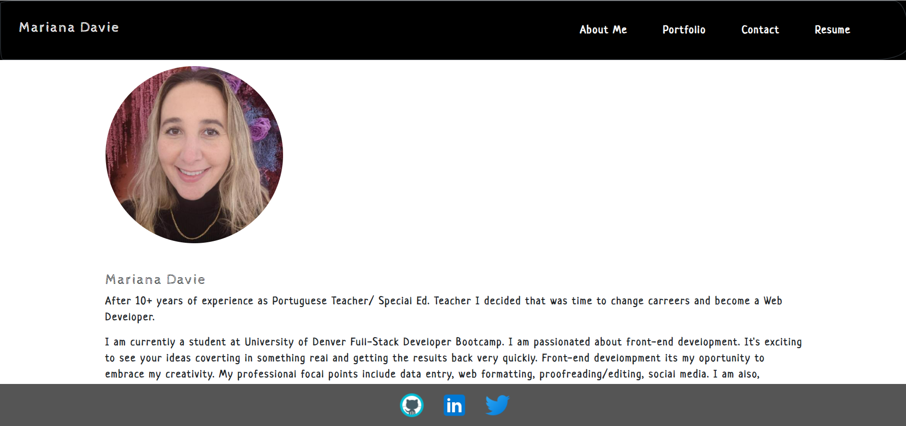

# Mariana Davie Portfolio

## Description 

The application contained within is a personal portfolio website and it was created with React.js. It contains an About page, Portfolio page, Contact page, and Resume page. The Resume page contains a link to my LinkdIN page and a dowload link for my resume and a list of my proficiencies. In the footer are links to my Github, LinkedIn, and Twitter.

## Table of Contents

* [Description](#description)
* [Technologies](#technologies)
* [GitHub Repository](#Github)
* [GitHub Deployed Page](#Github)
* [Application](#application)

## Technologies 

* JavaScript
* JSX
* React
* React-Dom
* Dotenv
* Emails-Js
* Bootstrap

## GitHub Repository

* [Mariana Davie Portfolio GitHub Repository ](https://github.com/mhdavie/react-portfolio-mhd)

## GitHub Deployed Application 

* [Mariana Davie Portfolio ](https://mhdavie.github.io/react-portfolio-mhd/#/about)

## Application Screenshot

